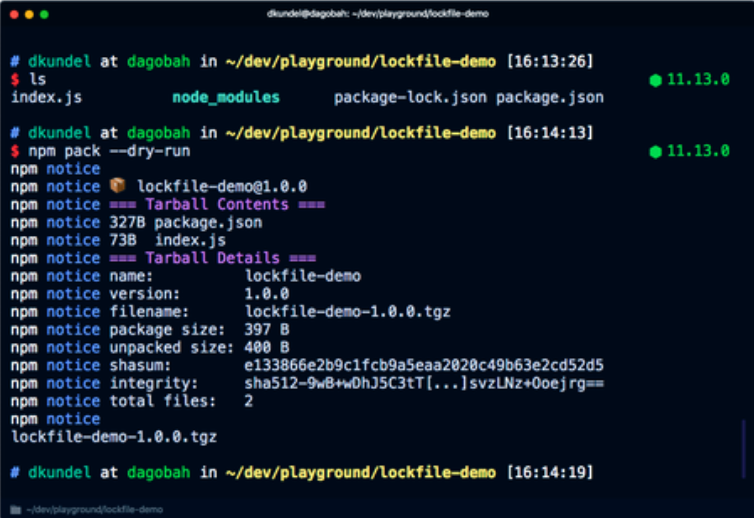
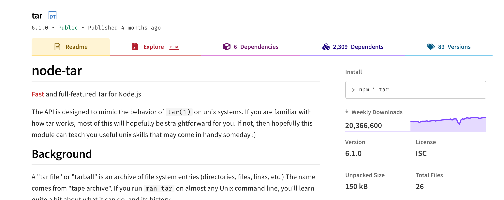

NPM is the official package manager for the NodeJS ecosystem. Since the first release of NodeJS it has come with NPM built-in. The initial release date for NPM was 12 January 2010 and since then has grown into the World largest software registry.

I would expect most engineers in the JavaScript ecosystem to know all about NPM, as it is critical to most local, CI and CD flows. However in the overview section I am going to cover the core functionality, as this is what we will focus on building later.

This is part of my ["under-the-hood of" series](/introducing-my-under-the-hood-of-series):

- [Git](/under-the-hood-of-git)
- [GraphQL](/under-the-hood-of-graphql)
- [Web bundlers (e.g. Webpack)](/under-the-hood-of-web-bundlers)
- [Type systems (e.g. TypeScript)](/under-the-hood-of-type-systems)
- [Test runners (e.g. Mocha)](/under-the-hood-of-test-runners)
- [Source maps](/source-maps-from-top-to-bottom)
- [React hooks](/under-the-hood-of-react-hooks)
- [Apollo](https://itnext.io/under-the-hood-of-apollo-6d8642066b28)
- [Auto formatters (e.g. Prettier)](/under-the-hood-of-vscode-auto-formatters)

<!-- A video for this talk can be found [here](**TODO**). Part of my "under-the-hood of" [video series here](https://www.youtube.com/channel/UCYi23MnKBKn0yLZKBrz5Bfw). -->

The article today will be broken down into:

1. [Overview](#1-overview)

2. [Module vs Package](#2-module-vs-package)

3. [Building our own NodeJS package manager](#3-building-our-own-nodejs-package-manager)

---

## 1: Overview

There are 3 parts to NPM

### CLI tool

The CLI is open-source code available on [Github](https://github.com/npm/cli). It is currently on version 7 and has had over 700 contributors. The CLI commands are NodeJS scripts and require the format `npm <command>`.

You can point the CLI to any registry e.g. `npm adduser --registry http://localhost:4873`

The most popular commands are:

#### `npm init`

- Setup a new package
- Creates a `package.json` (among other things)

#### `npm install`

- Code located in [install.js](https://github.com/npm/cli/blob/latest/lib/install.js#L111).
- Uses `npm-registry-fetch` https://github.com/npm/npm-registry-fetch
- Generates `node_modules`
- Downloads dependencies defined in `package.json` (see "Module resolution" below)
- Generates lockfile (see "Lockfile" below)
- Utilises a cache (see "Cache" below)

Example output below:


##### Lockfile

Generates `package-lock.json` - describes dependency tree that was installed. For deterministic installs (subsequent installs). If it exists, the install is driven by that. The lockfile stores an 'integrity' hash for each dep. Ths hash (checksum) is of the package tarball uploaded to registry. Can be SHA-1 (older NPM) or SHA-512 (newer NPM). Its akin to a [Subresource Integrity](https://w3c.github.io/webappsec-subresource-integrity/) used in HTML/browsers.

##### Module resolution

- NPM installs per package and sequentially i.e. moves on once package installed. This means it can be quite slow to finish.
- Currently installs all of the nested dependencies as efficiently (or flat) as possible. If a version is the first for a dependency it is top-level, if it is not the first version then it is stored with the parent who requires it.
- The old package resolution (pre npm v5) was done on disk by NodeJS (node_modules), this was much slower and is not used anymore.
- Example resolution below


##### Cache

- Stores http request/response data and other package-related data
- Uses `pacote`. Library responsible for package fetching
- All data passed through the cache is verified for integrity on insertion and extraction
- Cache corruption will trigger a refetch, so clearing cache should only be necessary for reclaiming disk space

#### `npm version`

- Bump local version, update `package.json` and `package-lock.json`
- Create version commit and tag for git

#### `npm pack`

- Create tarball (a zip) of the package (`package.tar.gz`)
- Example screenshot below:



#### `npm publish`

- Code located in [publish.js](https://github.com/npm/cli/blob/latest/lib/publish.js)
- Runs `npm pack` as part of it
- Sends tarball to registry
- Publishing a package consists of at least 1 step (http PUT) with a metadata payload and tarball
- See in the logs printed `"npm http fetch PUT 200"`

### Registry

Large public database of JavaScript packages and the meta-information surrounding it. Versioned like git.

Uses Apache's NoSQL database <i>Couch DB</i> to manage publicly available data (it offers good storage performance and replication). It has database for "users" and one for "registry", the latter holds the packages.

#### Tarballs

It uses Couch DB's [attachments](https://docs.couchdb.org/en/stable/intro/api.html#attachments) for package tarballs. It is incredlby easy to upload or download an attachment from Couch, simpler than most other NoSQL.

#### API

Couch naturally exposes HTTP endpoints which means it has an API built into it by default. For auth there is a `/_session` endpoint (to create a new cookie-based session) or it accepts an `Authentication` header for basic auth, both natively. Using design document `Rewrites` (see below section) you can build redirects to different parts of the database

#### Querying

Couch DB is very dynamic in that it allows you to create a kind of schema called a "design document" for a given section. This can include javascript functions (yes it can store and run JS code internally) which execute at given events e.g. `Updates` is list of functions which run when a document is updated. It also allows `Views` which are function that take document data and produce searchable lists of information based on the document's contents. There are other types of dynamic mechanisms, more details [here](https://docs.couchdb.org/en/stable/api/ddoc/index.html).

#### NPM links

The Couch DB tables and API for registry details are [here](https://github.com/npm/registry/blob/master/docs/REGISTRY-API.md#package) (a repository for Registry documentation). Couch DB views used by the Registry are found in [npm-registry-couchapp](https://github.com/npm/npm-registry-couchapp). An example Docker image for their DB setup is [npm-docker-couchdb](https://github.com/npm/npm-docker-couchdb). It details how to update a local NPM client to use a local CouchDB registry ([here](https://github.com/npm/npm-registry-couchapp#using-the-registry-with-the-npm-client)), example below.

    npm config set registry=http://localhost:5984/registry/_design/app/_rewrite

Some apps use the popular lightweight private proxy app [verdaccio](https://github.com/verdaccio/verdaccio), for many reasons one of which is independent caching incase NPM is down.

### Website

Found at `https://www.npmjs.com/`, a domain first registered on 19th March 2010.
It is built using Webpack, React and Lodash. Its assets are served via CDN CloudFlare. Any payments are processed via Stripe.

Connects and reads data from the registry Couch DB instance.

Packages are located at `https://www.npmjs.com/package/<package name>`.

The README markdown file is loaded as the landing page content with markdown rendered as HTML.

NPM also shows a load of other information such as the weekly download number, latest version, unpacked size and github location.



---

## 2. Module vs Package

A module is a file or directory that can be loaded by Nodejs, located inside `node_modules`.

CLI packages are not modules, they cannot be loaded by NodeJS until unzipped into a folder first.

2 versions of the same module can exist (module@1.0.0 and module@1.0.1) and they will not conflict. Generally npm packages are modules, loaded via `require()` or `import`

---

## 3: Building our own NodeJS package manager

We will be building an app which includes all 3 aspects of NPM.

1. Registry
2. CLI
3. Website

The aim is to get a basic PoC which will work for all 3.

Using an `example-lib` (a small package which returns some text) and `example-app` (a small express server using the previous package) we can test it works.

Wrapping all of the above in a single mono-repository with multiple `packages`.

### Registry

For this we will use the default couchdb Docker image. It includes a basic unauthenticated CouchDB instance.

We will use docker-compose to set up our apps.

Our `docker-compose.yml` starts like this:

```yaml
version: "3.0"

services:
  couchdb_container:
    image: couchdb:1.6.1
    ports:
      - 5984:5984
```

It does not need a volume mounted or anything else at this point.

We will use a Makefile to assist in running. We start by building and creating the registry database. Later I added a `stop` and `reset` so we could kill the docker application and reset the database quickly.

`Makefile` below:

```bash
up:
	docker-compose up --build

db:
	curl -XPUT http://localhost:5984/registry

stop:
	docker-compose stop

reset:
	curl -X DELETE \
		'http://localhost:5984/registry' \
		-H 'content-type: application/json'
```

Opening the browser confirms the database and couchDb instance exists


### CLI

Located in our monorepo in `packages/cli/`. We will only be creating 2 commands for this PoC.

1. Install
2. Publish

The `package.json` will look like below

```json
{
  "bin": {
    "our-npm-install": "./scripts/install.js",
    "our-npm-publish": "./scripts/publish.js"
  }
}
```

Using `bin` means inside the `packages/cli` folder we can run below:

```
npm install -g .
```

And from any directory in a terminal we can run the commands like this.

> our-npm-publish

> our-npm-install

I could have chosen to split these into a single script and use arguments, like the real NPM, but it did not seem worth it for this PoC. If I had gone that route I would have used `yargs`.

#### Install script

Located at `packages/cli/scripts/install.js`

It has 4 steps:

1. Grab the package name and `ourDeps` object, from the current working directory `package.json`
2. Iterate over each item in `ourDeps`, the version is ignored for our PoC.
   1. make a `fetch` request to the couch-db tarball attachment (looks like `http://localhost:5984/registry/{repo-name}/{repo-name}.tar.gz`)
   2. write the file to a local `tmp.tar.gz` file (for processing)
3. Extract the `tmp.tar.gz` contents using the `tar` library, into the current working directory `node_modules/{repo-name}`.
4. Finally delete the `tmp.tar.gz` file

The code is here.

```javascript
#!/usr/bin/env node

const fetch = require("node-fetch")
const { writeFile } = require("fs")
const { promisify } = require("util")
const tar = require("tar")
const fs = require("fs")

const writeFilePromise = promisify(writeFile)
const apiUrl = "http://localhost:5984/registry"
const outputPath = `${process.cwd()}/tmp.tar.gz`

async function extractPackage(repoName) {
  const zipExtractFolder = `${process.cwd()}/node_modules/${repoName}`

  if (!fs.existsSync(zipExtractFolder)) {
    // create package in node_mods
    fs.mkdirSync(zipExtractFolder)
  }
  try {
    // Step 3
    await tar.extract({
      gzip: true,
      file: "tmp.tar.gz",
      cwd: zipExtractFolder, // current extract
    })
    console.log("Extract complete")
  } catch (e) {
    console.log("Extract error: ", e.message)
  }
}
async function downloadPackage(repoName) {
  // Step 2.1
  return (
    fetch(`${apiUrl}/${repoName}/${repoName}.tar.gz`)
      .then(x => x.arrayBuffer())
      // Step 2.2
      .then(x => writeFilePromise(outputPath, Buffer.from(x)))
      .catch(e => console.log("Download Error: ", e.message))
  )
}

async function run() {
  // Step 1
  const package = require(`${process.cwd()}/package.json`)
  // Step 2 - process each dep
  Object.keys(package.ourDeps).map(async repoName => {
    await downloadPackage(repoName)

    await extractPackage(repoName)

    // Step 4 - remove tar
    fs.unlinkSync(outputPath)
    console.log(`Downloaded: ${repoName}`)
  })
}

run()
```

#### Publish script

Located at `packages/cli/scripts/publish.js`

It has 4 steps:

1. From the current working directory grab
   1. `package.json` file `name` field
   2. The `README.md` contents
2. Create a tarball of the current working directory
3. Send the package tarball (as an attachment) and README contents (as plain text) to our couchdb instance, the document name is the package name.
4. Delete the local tarball file

```javascript
#!/usr/bin/env node

const { unlinkSync, readFile } = require("fs")
const tar = require("tar")
const { promisify } = require("util")
const nano = require("nano")("http://localhost:5984")

const readFileAsync = promisify(readFile)

async function sendPackage(repoName, readmeContents) {
  const tarballName = `${repoName}.tar.gz`
  const filePath = `${process.cwd()}/${tarballName}`

  const tarballData = await readFileAsync(filePath)

  const registry = nano.db.use("registry")
  let response
  try {
    const docName = repoName

    // Step 3
    const response = await registry.insert({ readmeContents }, docName)
    await registry.attachment.insert(
      docName,
      tarballName,
      tarballData,
      "application/zip",
      { rev: response.rev }
    )
  } catch (e) {
    console.log("Error:", e)
  }
  console.log("Response success: ", response)
}

async function packageRepo(repoName) {
  try {
    // Step 2
    await tar.create(
      {
        gzip: true,
        file: `${repoName}.tar.gz`,
        cwd: process.cwd(),
      },
      ["./"]
    )
  } catch (e) {
    console.log("gzip ERROR: ", e.message)
  }
}

async function run() {
  // Step 1.1
  const repoName = require(`${process.cwd()}/package.json`).name
  // Step 1.2
  const readmeContents = await readFileAsync(`${process.cwd()}/README.md`, {
    encoding: "utf8",
  })

  await packageRepo(repoName)

  await sendPackage(repoName, readmeContents)

  // Step 4 - remove file
  unlinkSync(`${repoName}.tar.gz`)
}

run()
```

### Website

Located under `packages/website` we will use Docker to create a basic NodeJS website.

Our `packages/website/Dockerfile` looks like.

```
FROM node:14-alpine

# Create app directory
RUN mkdir -p /usr/src/app
WORKDIR /usr/src/app

# Install dependencies
COPY package.json package-lock.json ./
RUN npm install

# Bundle app source
COPY . ./

# Exports
EXPOSE 3000
CMD [ "npm", "run", "start.dev" ]
```

The website details are located in `packages/website/src/server.js`

For a request to the `/packages/:package-name` url

1. Query the couchdb instance for the package name
2. Using `showdown` library, render the README markdown as HTML.

If no package is found a nice message is printed.

```javascript
// deps...
const nano = require("nano")("http://couchdb_container:5984") // no auth for GET

// Constants
const PORT = 3000
const HOST = "0.0.0.0"

// couchdb
async function findOne(packageName) {
  try {
    const registry = nano.db.use("registry")
    // Step 1
    const doc = await registry.get(packageName)
    console.log("client result: ", doc)
    return doc
  } catch (err) {
    console.log("ERROR: ", err.message)
  }
}

// App
const app = express()
app.get("/packages/:packageName", async (req, res) => {
  const packageName = req.params["packageName"]

  const result = await findOne(packageName)
  if (result) {
    const converter = new showdown.Converter()
    // Step 2
    const html = converter.makeHtml(result.readmeContents)
    res.send(html)
  } else {
    res.send("No package found")
  }
})

app.listen(PORT, HOST)
console.log(`Running on http://${HOST}:${PORT}`)
```

Lastly we will add the website to our `docker-compose.yml` so we can run it with the registry database.

The `docker-compose.yml` now looks like this

```
version: "3.0"

services:
  web:
    build: packages/website
    ports:
      - "3000:3000"
    restart: always
    volumes:
      - ./packages/website:/usr/src/app

  couchdb_container:
    image: couchdb:1.6.1
    ports:
      - 5984:5984
```

### Testing it works

We now have 3 of the core 3 jobs carried out by NPM, so we need to test it works using an example application and example library.

#### `example-lib`

The library will just return a string.

The `packages/example-lib/package.json` looks like below.

```json
{
  "name": "example-lib",
  "main": "index.js"
}
```

The `packages/example-lib/index.js` is below, it just returns a string.

```javascript
module.exports = () => "example-lib data"
```

#### `example-app`

It will print information from a real library (e.g. express) and our example library.

Our `packages/example-app/package.json` looks like this. As mentioned the version is ignored for our PoC.

```json
{
  "ourDeps": {
    "example-lib": null
  }
}
```

The `packages/example-app/src/index.js` is below.

```javascript
const express = require("express")
const exampleLib = require("example-lib")

console.log("express function", express.urlencoded)
console.log("example-lib function", exampleLib())
```

Lastly we update the `reset` in our `Makefile` to also remove the package installed and uninstall the global binary commands. The final file is below:

```bash
up:
	docker-compose up --build

db:
	curl -XPUT http://localhost:5984/registry

stop:
	docker-compose stop

reset:
	curl -X DELETE \
		'http://localhost:5984/registry' \
		-H 'content-type: application/json'
	rm -rf packages/example-app/node_modules/example-lib
	cd packages/cli && npm uninstall -g our-npm-cli
```

#### Running the example

1. Setup commands

   > make up

   > make reset

2. Check website for the package

- `GET http://localhost:3000/packages/example-lib` -> Notice the package does not exist yet

3. Setup the database and CLI

- `make db`
- `cd packages/cli`
- `npm install -g .` -> Install the 2 CLI scripts globally (see `bin` inside `package.json`)

4. Publish the package then check website

- `cd ../example-lib`
- `our-npm-publish` -> Publish the `example-lib` package to our registry
- `GET http://localhost:5984/registry/example-lib/example-lib.tar.gz` -> Location of the registry package tarball
- `GET http://localhost:3000/packages/example-lib` -> Package `README` on website (screenshot below)
  

5. Use package

- `cd ../example-app`
- `npm start` -> See the missing package error (screenshot below)
  

- `our-npm-install` -> Install the packages from `package.json` -> `ourDeps` list (screenshot below)
  

- `npm start` -> Package found, now it works (screenshot below)
  

So thats it 🙌, our mini NPM works.

I encourage anyone that is interested to check out the [code](https://github.com/craigtaub/our-own-npm) and play with the mechanism yourself.

---

## What have we missed?

As mentioned there is functionality to each of the 3 core elements to NPM which we have omitted from our app. Some of those are:

CLI

- Various commands including `init` and `pack`
- Ability to download a package via argument
- Creating lockfile (including versions and dependency info)
- Caching and request/response data
- Flags e.g `--devDeps`
- Dependency module resolution (NPM has a lot of logic for managing this, see overview section)

Registry

- Better authentication on the CouchDB instance
- `sha512sum` hash of package/tarball contents ("Subresource Integrity" check)
- Install counter
- Semvar package versions

Website

- Show install increment
- Show versions and intergrity hash
- A decent UI

---

Thanks so much for reading, I learnt a huge amount about NPM from this research and I hope it was useful for you. You can find the repository for all this code [here](https://github.com/craigtaub/our-own-npm).

Thanks, Craig 😃
